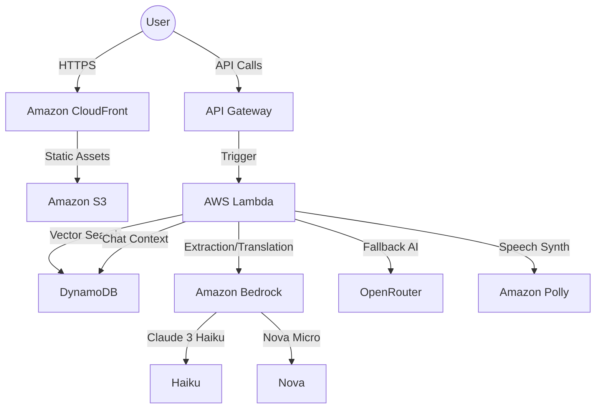

# 🏛️ SarkarSaathi: System Architecture

The architecture is designed to be highly scalable, low-latency, and serverless, optimizing for both performance and cost.

## 🏗️ High-Level Design

## 🧱 Component Breakdown

### 1. Frontend: React Web Portal
- **Client-side Logic**: Manages user session state, selected language, and real-time chat history.
- **Voice Interaction**: Integrates with the native Web Speech API for voice recognition and uses the `handle_tts` endpoint for high-quality regional voice playback.
- **Localization**: Uses `locales.js` and `LANG_SYNC` safety logic to ensure UI labels are consistent across all 10 supported regional languages.

### 2. Backend Orchestration: AWS Lambda
- **Handler**: Routes requests based on HTTP paths (`/query`, `/chat`, `/tts`, `/session`).
- **Profile Extraction**: Uses a hybrid approach, combining rule-based regex with LLM-powered extraction (Claude 3 Haiku) to build a structured user profile.
- **Scheme Matching**: Performs a weighted search against the DynamoDB scheme database to identify the best matches for a given profile.
- **Translation Pipeline**: Implements a parallel, chunked translation system using `ThreadPoolExecutor` to translate scheme details into regional languages in under 10 seconds.

### 3. AI & Natural Language Processing
- **Amazon Bedrock**: 
  - **Claude 3 Haiku**: Used for high-speed profile extraction and bulk translation.
  - **Nova Micro**: Powering the conversational chatbot with Chain-of-Thought (CoT) reasoning.
- **Natural Language Parsing**: Robust regex-based parsers handle structured JSON output from LLMs even when formatting varies.

### 4. Data Storage & Persistence
- **Amazon DynamoDB**: 
  - **Sessions Table**: Stores user profiles, chat history, and last search queries for persistent cross-device access.
  - **Cache Table**: (Optional) Used for caching LLM responses to reduce costs and improve performance.
- **Amazon S3**: Hosts the production-built React assets.

### 5. Delivery & Security
- **Amazon CloudFront**: Acts as a CDN for the frontend and enforces HTTPS across the entire application.
- **CORS Handling**: Lambda and API Gateway are configured to handle Cross-Origin Resource Sharing safely for the frontend domain.

## 📊 Data Flow

1.  **User Input**: User submits a natural language search query.
2.  **Extraction**: Lambda extracts demographic data (age, income, location, etc.).
3.  **Matching**: The system matches the profile against 1000+ government schemes.
4.  **Translation**: Matches are translated in parallel into the user's selected language.
5.  **Output**: The frontend renders the results with localized labels and enables optional TTS playback.

---
*Built for scale, speed, and inclusivity.* 🏛️🚀✅
